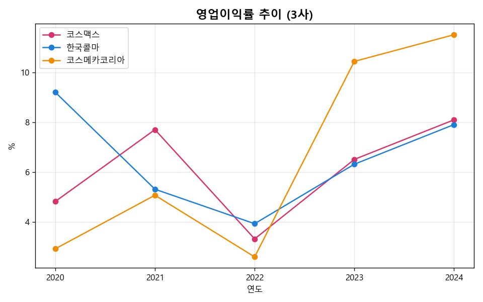
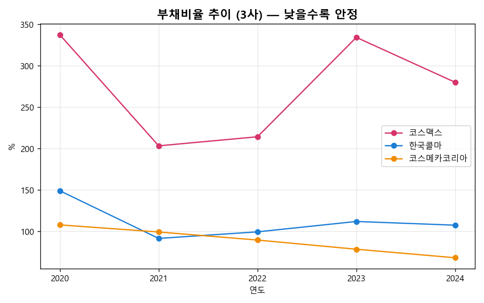
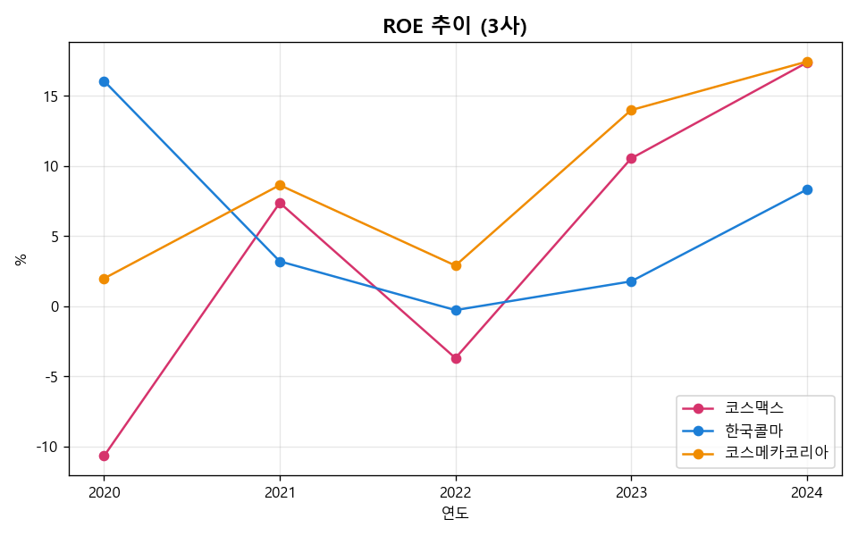
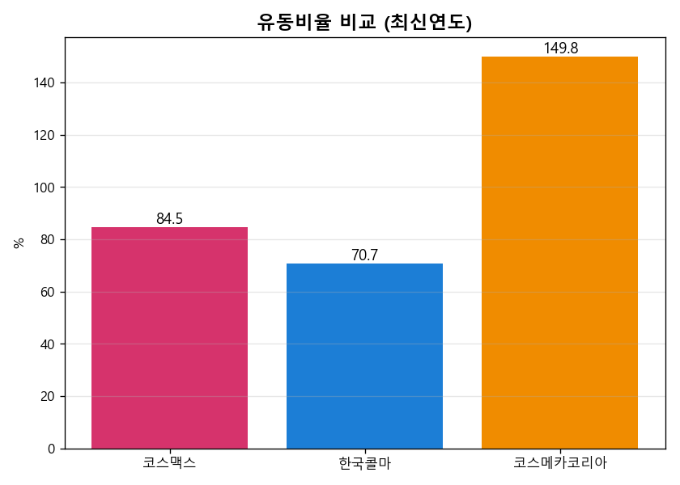
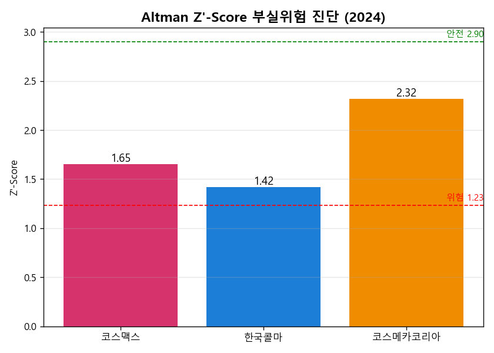
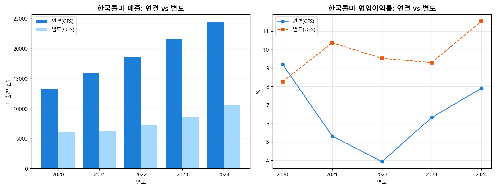
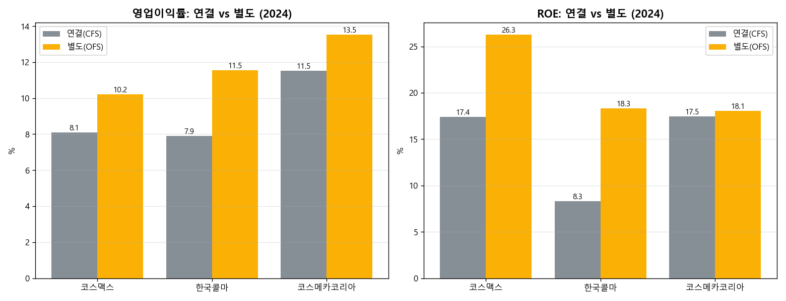
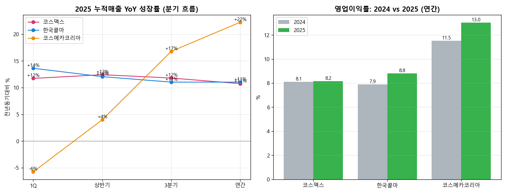
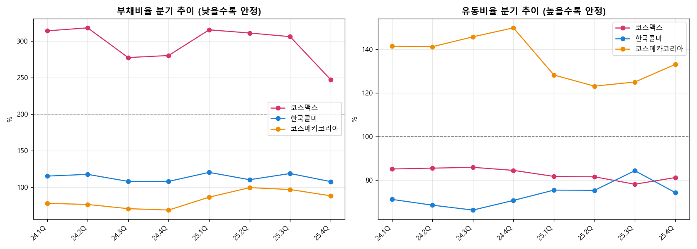
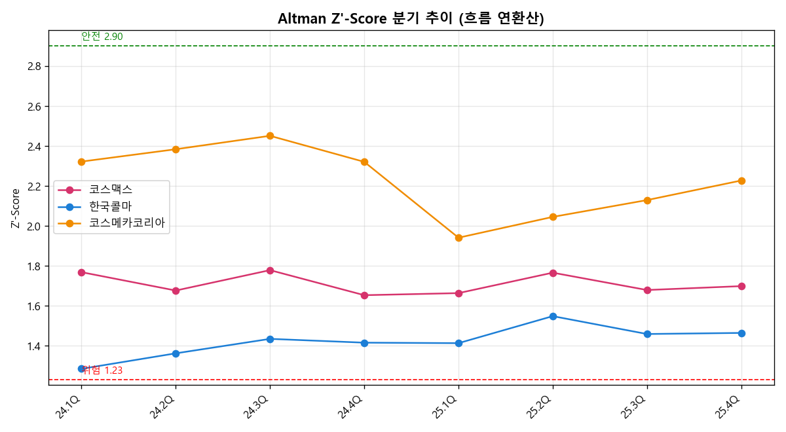

# 화장품 ODM 3사 재무·신용 분석 (2020–2025)

> DART 전자공시 재무제표를 **SQL과 Python**으로 분석해, 화장품 ODM 3사
> (**코스맥스·한국콜마·코스메카코리아**)의 **수익성·안정성·부실위험**을 진단한 프로젝트.
> 여신심사관·IR·전략기획의 시선으로 *"누가 성장하고, 누가 재무적으로 단단한가"* 를 데이터로 답한다.

**Tech:** Python (pandas · matplotlib) · SQL (SQLite, 윈도우 함수·CTE·RANK) · DART OpenAPI
**분석 기준:** 연결재무제표 5개년(2020–2024) 구조분석 + **분기 누적 데이터로 2025년 흐름** 추적 · 재무비율 8종 + **Altman Z'-Score**(부실위험)

> 자매 프로젝트 [`kbeauty-export-analysis`](https://github.com/Dopamineliminated/kbeauty-export-analysis)에서
> *"ODM이 K뷰티 성장의 구조적 수혜자"* 라고 결론냈다. 이 프로젝트는 그 후속편 —
> **"그렇다면 그 ODM들은 재무적으로 진짜 튼튼한가?"** 를 개별 기업 재무제표로 검증한다.

---

## TL;DR — 핵심 결론

1. **산업 동반 회복.** 3사 모두 2022년 동반 부진(중국 봉쇄·원가 부담) 이후 **2023~24년 V자 회복**, 2024년 매출·수익성이 사상 최고 수준. 영업이익률은 3사 모두 8~12%대로 수렴.
2. **외형은 대형 2사, 효율은 소형사.** 매출은 **한국콜마(2.45조) > 코스맥스(2.17조) ≫ 코스메카(0.52조)**. 그러나 영업이익률·ROE는 **코스메카코리아가 1위**(11.5%·17.5%).
3. **성장–안정의 트레이드오프.** **코스맥스**는 외형·수익성 회복이 강하지만 **부채비율 280%·유동비율 84%·이자보상배율 2.6배**로 레버리지 의존도가 높다. 반면 **코스메카코리아**는 **부채비율 68%·이자보상배율 14배**로 재무 무결성이 압도적.
4. **부실위험(Altman Z') 진단.** 3사 모두 회색지대지만 서열이 뚜렷하다 — **코스메카(2.32, 안전 근접) > 코스맥스(1.65) > 한국콜마(1.42, 위험선 근접)**. *여신 관점의 신용리스크는 코스메카 < 코스맥스·한국콜마.*
5. **연결의 함정 — 한국콜마는 별도로 봐야 한다.** 한국콜마 연결 매출의 **약 57%가 제약 등 자회사**라 본업이 가려져 있었다. **별도(OFS)** 기준으로 보면 영업이익률 7.9%→**11.5%**, ROE 8.3%→**18.3%**로 — *순수 화장품 ODM 본체로는 코스메카에 필적하는 우량*임이 드러난다.
6. **2025년 흐름 — 코스메카의 가속.** 분기 누적 데이터로 보면 코스맥스·한국콜마는 연 +11% 안정 성장인 반면, **코스메카코리아는 1분기 −5.8%(역성장)에서 출발해 3분기 +16.8%, 연간 +22.2%로 갈수록 가속**. 연간 숫자만으론 못 보는 하반기 모멘텀이 분기 데이터에서 드러난다. 2025년 영업이익률도 3사 모두 개선(코스메카 **13.0%** 선두).
7. **분기 신용지표 — 성장의 이면.** 분기말 BS로 신용지표를 8개 분기 추적하니, **코스메카가 외형 가속과 동시에 부채비율 68%→88%·Altman Z' 2.32→1.94(후 2.23 회복)로 레버리지가 올라간** 사실이 잡힌다. *고성장을 부채로 조달*한 것 — 연말 한 컷이 아니라 분기로 봐야 보이는 '성장의 질'.

> 숫자 산출 근거는 [`output/key_metrics.md`](output/key_metrics.md), 상세 해설은 [`report/REPORT.md`](report/REPORT.md),
> 면접 활용은 [`report/면접활용_가이드.md`](report/면접활용_가이드.md) 참조.

---

## 분석 결과

### 1) 영업이익률 — 2022 동반 저점 → 코스메카 역전


2020년엔 한국콜마(9.2%)가 선두였지만, 2023년부터 **코스메카코리아가 10%대로 역전**한다. 규모는 가장 작지만 미국 자회사(잉글우드랩) 정상화와 고부가 라인 확대로 마진 체질이 가장 빠르게 개선됐다.

### 2) 부채비율 — 코스맥스의 레버리지 부담


코스맥스는 200~330%대를 오가며 3사 중 가장 높다. 공격적 외형 성장(설비·해외법인 투자)을 부채로 조달한 결과다. 코스메카는 108% → **68%**로 꾸준히 디레버리징하며 정반대 행보.

### 3) ROE — 회복의 질


코스맥스는 2020·2022년 **순손실(ROE 마이너스)**을 겪었으나 2024년 17.4%로 급반등. 코스메카는 변동성 없이 17.5%까지 꾸준히 상승해 **이익의 안정성**에서 앞선다.

### 4) 유동비율 — 단기 지급능력


코스메카(150%)만 100%를 넘고, **코스맥스(84%)·한국콜마(71%)는 100% 미만** — 유동부채가 유동자산을 초과하는 단기 유동성 부담이 존재한다.

### 5) Altman Z'-Score — 부실위험 종합 진단


장부가 기반 Altman Z'(제조업·비상장 변형)로 5개 재무축을 합산한 종합 부실위험 지표. **코스메카(2.32)가 안전지대(2.90)에 가장 근접**, 한국콜마(1.42)는 위험선(1.23)에 가장 가깝다.

### 6) 연결의 함정 — 한국콜마는 별도(OFS)로 봐야 한다


한국콜마 연결 매출의 약 57%는 HK이노엔(제약) 등 자회사 몫이라, **연결만 보면 화장품 ODM 본업이 가려진다.** 별도(본체) 기준으로 보면 영업이익률은 연결 7.9% → **11.5%**, ROE는 8.3% → **18.3%**로 크게 뛴다. *순수 화장품 ODM 본체로는 한국콜마가 코스메카에 필적하는 우량* — 동일 사업끼리 비교하려면 별도가 맞다.

### 7) 3사 공통 — 본체(별도)는 모두 더 우량, 그러나 의미는 다르다


코스맥스·코스메카도 점검하니 **세 회사 모두 본체(별도) 수익성이 연결보다 높다**(자회사·해외법인이 마진을 희석). 다만 결이 다르다.
- **코스맥스**: 별도 ROE **26.3%**(연결 17.4%)로 본체 자본효율이 최상위. 하지만 별도 부채비율도 192.9% — *레버리지는 연결만의 문제가 아니라 본체의 구조적 특성*.
- **코스메카**: 연결↔별도 격차가 가장 작다(ROE 17.5%→18.1%) — *본체·미국법인 모두 건전한 "일관된 우량"*.
- **한국콜마**: 격차가 가장 크다(ROE 8.3%→18.3%) — *연결이 본업을 가장 심하게 가렸던 케이스*.

### 8) 2025년 흐름 — 분기 데이터로 본 모멘텀


연간 숫자는 결과만 보여준다. **분기 누적(YTD) 데이터**로 연중 모멘텀을 추적했다(2025 vs 2024 동기).
- **코스맥스·한국콜마**: 연중 내내 +11~13%대 **안정 성장**. 2025 연간 매출 2.40조·2.72조로 사상 최대.
- **코스메카코리아**: **1분기 −5.8% 역성장 → 3분기 +16.8% → 연간 +22.2%** 로 분기 갈수록 **가속**. 하반기 폭발적 성장이 분기 데이터에서만 포착된다.
- **수익성**: 2025 영업이익률 3사 모두 개선(코스맥스 8.2%·한국콜마 8.8%·**코스메카 13.0%**). 앞서 본 구조적 서열(코스메카 우위)이 2025년에 더 벌어졌다.

### 9) 분기 단위 신용지표 추적 — 성장의 이면



분기말 BS를 붙여 신용지표를 **8개 분기(2024~2025)**로 추적했다(연환산 Altman은 연말값이 연간 분석과 일치 — 검증됨).
- **숨은 반전 — 코스메카의 레버리지 상승.** 외형이 가속한 2025년, 코스메카는 **부채비율 68%→88%, 유동비율 141%→133%, Altman Z' 2.32→25.1Q 1.94로 급락 후 2.23 회복**. *고성장을 부채로 조달*한 흔적으로, 여전히 3사 중 최우량이지만 **성장의 질을 분기로 봐야 잡힌다.**
- **계절성.** 코스맥스 부채비율은 매년 1Q에 고점(운전자본·배당)→4Q 저점. 연말 한 컷만 보면 놓치는 패턴.
- **한국콜마는 점진 개선.** Altman Z'가 위험선(1.23) 부근(24.1Q 1.29)에서 1.46까지 꾸준히 상승.

---

## 기술 스택 & 방법

| 단계 | 도구 | 내용 |
|---|---|---|
| 수집 | **DART OpenAPI** | 상장사 고유번호 매핑 후 전체재무제표 **연결(CFS)·별도(OFS)** 5개년 수집 ([`src/fetch_dart.py`](src/fetch_dart.py)) |
| 적재 | **SQL** (SQLite) | `schema.sql`로 원천/정제 테이블 정의(`fs_basis` 차원), 라인아이템 5,400여 건 적재 ([`src/build_db.py`](src/build_db.py)) |
| 분석 | **SQL** 쿼리 | 윈도우 함수(LAG)·CTE·CASE·RANK로 YoY·비율·순위·연결vs별도 비교 ([`sql/queries.sql`](sql/queries.sql)) |
| 분석 | **Python** (pandas) | 재무비율 8종 + **Altman Z'-Score** 계산 ([`src/analyze.py`](src/analyze.py)) |
| 흐름 | **분기 누적(YTD)+BS** | 분기보고서로 2025년 모멘텀(YoY) + 분기 신용지표(부채·유동·이자보상·Altman) 추적 ([`src/quarterly.py`](src/quarterly.py)) |
| 시각화 | **matplotlib** | 차트 11종 자동 생성 (`output/charts/`) |

## 프로젝트 구조

```
corp-credit-analysis/
├── data/            # SOURCES.md(출처), raw/(연간 JSON), raw_q/(분기 JSON), corp_codes.csv
├── sql/             # schema.sql, queries.sql
├── src/             # config · fetch_dart · build_db · run_sql · analyze · quarterly
├── output/          # corp.db, charts/*.png, key_metrics.md
└── report/          # REPORT.md(분석 리포트), 면접활용_가이드.md
```

## 실행 방법

```bash
pip install -r requirements.txt

# DART 무료 인증키 발급(https://opendart.fss.or.kr) 후
export DART_API_KEY=발급받은키        # 또는 data/.dart_key 파일에 키 저장

python src/fetch_dart.py   # DART에서 연간 재무제표 수집 -> data/raw/
python src/build_db.py     # SQLite DB 적재
python src/run_sql.py      # 분석 SQL 7종 실행·출력
python src/analyze.py      # 재무비율 + Altman Z + 차트 8종 생성
python src/quarterly.py    # 2025 분기 흐름 + 분기 신용지표 + 차트 9~11 생성
```

## 데이터 출처 & 한계
- 출처: 금융감독원 전자공시(DART) OpenAPI. 상세·한계는 [`data/SOURCES.md`](data/SOURCES.md).
- 기본은 연결 기준이며, 비(非)화장품 사업이 큰 **한국콜마는 별도(OFS)로 보정 분석**을 추가했다(위 6번).
- 이자보상배율의 분모는 금융비용(FinanceCosts)으로 근사했다(보수적 계산).
- Altman Z'는 장부가 기반 변형으로, 절대수치보다 **3사 상대비교**로 해석한다.

> 본 분석은 공개 1차 재무데이터 기반의 학습/포트폴리오 목적이며, 투자 권유가 아니다.
